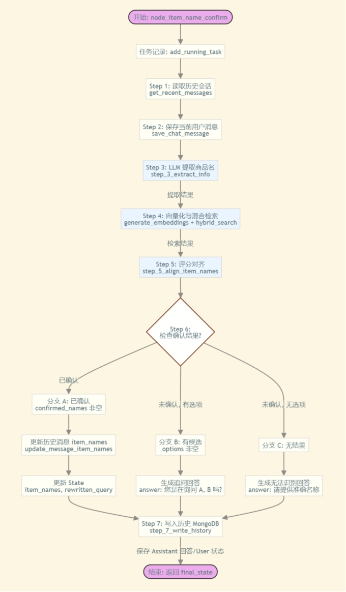

# 掌柜智库项目(RAG)实战

## 9. 检索数据节点实现与测试

### 9.1 产品确认节点 (node_item_name_confirm)

**文件**: `app/query_process/agent/nodes/node_item_name_confirm.py`

#### 节点作用与实现思路

**节点作用**: 根据用户提出的问题，初步对齐要问的是**哪个产品**以便定位手册。
方式就是利用大模型从问题中提取产品名，与知识库中已有问题进行向量比对。
如果没法确定则返回用户把候选名单给**用户引导用户确认产品**。

**次要任务**：

1. 取出历史会话
2. 保存当前问题至历史对话库
3. 利用大模型讲当前问题进行改写，主要目的是处理代词问题。
4. 一旦确定设备，则将当前和历史会话标记产品名称

**实现思路**:

1.  **路由分发**: 采用轻量级的条件判断逻辑，通过文件后缀 (`.pdf` / `.md`) 决定激活 `is_pdf_read_enabled` 还是 `is_md_read_enabled` 状态位，实现不同格式文件的差异化处理。
2.  **元数据提取**: 在入口处统一提取文件名 (`file_title`)，作为贯穿整个知识库构建流程的唯一标识，避免后续节点重复解析。
3.  **任务监控初始化**: 集成 `task_utils`，记录当前任务 ID 和初始状态，为前端提供实时的进度反馈。

#### 步骤分解



####  流程说明

1. **获取历史会话**：根据 `session_id` 从 MongoDB 中获取最近 10 条历史会话记录，用于构建上下文。
2. **保存当前问题**：将用户当前的提问保存到数据库，确保对话历史的完整性。
3. **意图理解与改写 (LLM)**：
   *   利用大模型分析当前问题及历史上下文。
   *   **提取商品名**：识别用户询问的核心商品名称（`item_names`），支持提取多个，返回 JSON 列表。
   *   **指代消歧与改写**：处理“它”、“这个”等代词，生成指代明确的重写问题 (`rewritten_query`)。
   *   **输出结构**：`{"item_names": [], "rewritten_query": ""}`。
4. **向量化评分 (BGE-M3)**：
   *   将提取出的 `item_names` 逐个进行向量化。
   *   在 Milvus 向量数据库中查询，与标准商品名进行比对，获取相似度评分（Score）。
5. **商品名对齐策略 (核心逻辑)**：
   *   **> 0.95 (确信匹配)**：
       *   **含义**：极高置信度，系统认为用户输入的名称与库中商品名几乎完全一致。
       *   **操作**：直接锁定该商品。若有多个 > 0.95，取最高分的一个。
   *   **0.8 ~ 0.95 (高概率候选)**：
       *   **含义**：较高置信度，但存在细微差异（如型号别名、模糊拼写），系统不敢100%确定。
       *   **操作**：将其作为“候选商品”，后续让用户确认。
   *   **0.6 ~ 0.8 (疑似候选)**：
       *   **含义**：中等置信度，可能是相关商品，也可能是误匹配。
       *   **操作**：取前 5 个作为宽泛的“候选列表”。
   *   **< 0.6 (无关/噪音)**：
       *   **含义**：低置信度，认为与库中商品无关。
       *   **操作**：直接丢弃，不作为有效商品名返回。
6. **确认状态检查与分支处理**：
   *   **分支 A：已明确确认 (Confirmed)**
       *   **条件**：有一个商品评分 > 0.95，或用户明确选定了一个商品。
       *   **动作**：
           1.  更新状态 `state`，写入确定的 `item_names` 和 `rewritten_query`。
           2.  **回溯更新**：将历史记录中未识别出商品名的对话，补充标记为当前确认的商品名（利用上下文一致性）。
           3.  进入下一节点（如检索节点）。
   *   **分支 B：未确认但有候选 (Ambiguous)**
       *   **条件**：没有 > 0.95 的商品，但有 > 0.8 的候选列表。
       *   **动作**：生成澄清话术（如“您是想问以下哪个产品：A, B, 还是 C？”），直接返回给用户，**中断流程**等待用户回复。
   *   **分支 C：未确认且无候选 (Unknown)**
       *   **条件**：所有商品评分均 < 0.6。
       *   **动作**：生成通用回复（如“抱歉，未找到相关产品，请提供准确型号”），直接返回给用户，**中断流程**。
7. **持久化状态**：
   *   将生成的答案（包括澄清追问或最终结果）写入 MongoDB 历史记录。
   *   如果有确定的 `item_names`，同步更新到数据库记录中。

#### 节点代码实现

本节点的核心逻辑是通过 `node_item_name_confirm` 函数协调多个子步骤函数完成。为了代码清晰和可维护性，我们将逻辑拆解为以下独立的方法：

##### **步骤1：导入依赖**

引入必要的系统库、LangChain 消息类型、以及项目中封装好的工具函数（如任务管理、MongoDB 操作、LLM 客户端、Milvus 客户端等）。

```python
import sys
import os
import json
import logging
from typing import List, Dict, Any, Optional
from langchain_core.messages import SystemMessage, HumanMessage
from mpmath import limit

from app.core.load_prompt import load_prompt
from app.query_process.agent.state import QueryGraphState
from app.utils.task_utils import add_running_task, add_done_task
from app.clients.mongo_history_utils import get_recent_messages, save_chat_message, update_message_item_names
from app.lm.lm_utils import get_llm_client
from app.lm.embedding_utils import generate_embeddings
from app.clients.milvus_utils import get_milvus_client, create_hybrid_search_requests, hybrid_search
from dotenv import load_dotenv,find_dotenv
from app.core.logger import logger

load_dotenv(find_dotenv())
```

##### 步骤2：**主流程：节点入口函数 (node_item_name_confirm)**

**功能**：串联功能所有步骤，作为 LangGraph 的节点入口。
**逻辑**：

1.  标记任务开始 (`add_running_task`)。
2.  获取历史消息 (`get_recent_messages`) 并保存用户当前问题 (`save_chat_message`)。
3.  执行提取信息。
4.  若提取到商品名，依次执行（搜索）、（对齐）。
5.  执行更新状态和 写入历史。
6.  标记任务完成 (`add_done_task`) 并返回最终 State。

```python
def node_item_name_confirm(state: QueryGraphState) -> QueryGraphState:
    """
    主节点函数：商品名称确认流程
    """
    logger.info(">>> node_item_name_confirm: 开始处理")
    
    session_id = state["session_id"]
    original_query = state.get("original_query", "")
    is_stream = state.get("is_stream", False)

    # 标记任务开始
    add_running_task(session_id, "node_item_name_confirm", is_stream)

    # 1. 获取历史记录
    history = get_recent_messages(session_id, limit=10)
    logger.info(f"Node: 获取到 {len(history)} 条历史消息")

    # 2. 保存用户当前消息 (初始保存，后续 step 7 会更新)
    message_id = save_chat_message(session_id, "user", original_query, "", state.get("item_names", []))
    logger.debug(f"Node: 用户消息已初始保存, ID: {message_id}")

    # 3. 提取信息
    extract_res = step_3_extract_info(original_query, history)
    item_names = extract_res.get("item_names", [])
    rewritten_query = extract_res.get("rewritten_query", original_query)
    
    # 更新 State 中的 rewrite_query
    state["rewritten_query"] = rewritten_query

    align_result = {}

    # 4. & 5. 如果有提取到商品名，进行搜索和对齐
    if len(item_names) > 0:
        query_results = step_4_vectorize_and_query(item_names)
        align_result = step_5_align_item_names(query_results)
    else:
        logger.info("Node: 未提取到商品名，跳过向量检索")

    # 6. 检查确认状态
    state = step_6_check_confirmation(state, align_result, session_id, history, rewritten_query)

    # 7. 写入最终历史
    final_state = step_7_write_history(state, session_id, history, rewritten_query, message_id)

    # 将 history 存入 state，供后续节点（如 node_answer_output）使用
    final_state["history"] = history

    # 标记任务完成
    add_done_task(session_id, "node_item_name_confirm", is_stream)
    
    logger.info(f"Node: 处理结束, Final State Item Names: {final_state.get('item_names')}")
    return final_state
```

##### **步骤3：提取商品名称 (step_3_extract_info)**

**功能**：利用 LLM 从用户当前问题及历史会话中提取核心信息。
**输入**：

*   `query`: 用户当前的问题字符串。
*   `history`: 最近的对话历史列表。

**逻辑**：

1.  构造包含历史对话和当前问题的 Prompt。
2.  调用 LLM（开启 JSON 模式），要求提取 `item_names`（商品名列表）并生成 `rewritten_query`（改写后的独立问题）。
3.  解析 LLM 返回的 JSON，处理可能的格式异常。
    **输出**：包含 `item_names` 和 `rewritten_query` 的字典。

**RAG 中重写用户提问（rewritten_query）的核心原因（重点环节）**

1. **修复用户输入的 “不完美”**：用户提问常存在口语化、模糊、错别字、信息缺失（比如 “这个怎么用” 缺上下文）等问题，重写后可补全信息、修正错误，让查询更精准（例：“张三的产品”→“查询张三相关的 XX 产品使用说明”）。
2. **适配知识库检索规则**：RAG 的核心是 “检索知识库找答案”，原始提问可能不符合知识库的索引 / 关键词体系（比如用户说 “咋弄”，知识库用 “如何操作”），重写后可对齐术语、补充检索关键词，提升召回率。
3. **增强上下文关联性**：多轮对话中，用户可能只说 “再说说这个”，重写时可结合历史对话补全上下文（例：“再说说这个”→“再说说 XX 产品的使用步骤”），避免检索跑偏。

重写提问的核心目标是：**把用户 “自然、模糊的原始问题” 转化为 “精准、适配检索规则的查询语句”**，最终提升 RAG 检索的准确性和答案的相关性。

先提取提示词：

位置：`prompts/rewritten_query_and_itemnames.prompt`

```json
历史会话：
{history_text}

当前用户问题：{query}

请根据历史会话和当前问题，提取用户正在询问的商品名称（item_names）。
1. 如果用户明确提到了商品名称，请提取出来。可能有一个或多个，但不能重复。
2. 如果用户使用了代词（如"这个"、"它"），请结合历史会话指代消解，确定商品名称。
3. 如果无法确定商品名称，item_names 返回空列表。
4. 请重新改写用户的问题（rewritten_query），使其成为包含商品名称的独立完整问题。

请直接返回JSON格式结果，格式如下：
{{
    "item_names": ["商品A", "商品B"],
    "rewritten_query": "关于商品A和商品B，..."
}}
```

方法细化实现：

```python
def step_3_extract_info(query, history) -> Dict:
    """
    利用LLM从当前问题以及历史会话中提取出主要询问的商品名称item_names（可多个，JSON列表形式）
    若商品名不够明确则返回空列表，同时根据上下文重新改写问题，保证问题独立完整
    :param query: 字符串 - 用户当前原始查询问题（如："这个多少钱？"）
    :param history: 列表[字典] - 近期会话历史，每条消息含role/text等字段，格式：[{"role": "user/assistant", "text": "消息内容", "_id": "消息ID"}, ...]
    :return: 字典 - 提取结果，固定包含2个字段，格式：
             {
                 "item_names": ["商品名1", "商品名2", ...],  # 提取的商品名列表，无则空列表
                 "rewritten_query": "改写后的完整问题"       # 包含商品名的独立问题，无则返回原始query
             }
    """
    # 代码核心步骤总结：
    # 1. 初始化准备：获取LLM客户端，拼接历史会话为文本格式，加载并拼接提示词，构造LLM调用的消息列表
    # 2. LLM调用与响应处理：调用LLM客户端获取响应，清理响应内容中的JSON代码块格式，解析为JSON字典
    # 3. 结果校验与异常处理：确保返回字典包含item_names/rewritten_query字段（缺失则补默认值），捕获所有异常并返回兜底结果

    # 1. 先获取llm客户端（用户提起商品名称和重写查询）
    logger.info("Step 3: 正在初始化 LLM 客户端...")
    client = get_llm_client(json_mode=True)
    # 构造历史对话文本，拼接为"角色: 内容"的格式，供LLM做上下文理解
    history_text = ""
    for msg in history:
        history_text += f"{msg['role']}: {msg['text']}\n"
    logger.info(f"Step 3: 历史上下文准备完成 (长度: {len(history_text)})")
    # print(f"{sys._getframe().f_code.co_name}: 历史消息对话文本：{history_text}")

    # 2. 处理和动态拼接提示词
    """
      为了让 Python 把大括号当作 “普通字符” 保留下来，f-string 规定：用双大括号 {{ 表示普通的左大括号 {，双大括号 }} 表示普通的右大括号 }。
    """
    prompt = load_prompt("rewritten_query_and_itemnames", history_text=history_text, query=query)
    logger.info(f"Step 3: 提示词加载成功")

    # 构造LLM调用的消息列表，包含系统角色（定义助手身份）和用户角色（传入提示词）
    messages = [
        SystemMessage(content="你是一个专业的客服助手，擅长理解用户意图和提取关键信息。"),
        HumanMessage(content=prompt)
    ]

    """
    # 替换后的通用格式（兼容绝大多数LLM接口）
    messages = [
        {
            "role": "system",  # SystemMessage 对应 role: "system"
            "content": "你是一个专业的客服助手，擅长理解用户意图和提取关键信息。"
        },
        {
            "role": "user",    # HumanMessage 对应 role: "user"（也可写 "human"，按接口要求调整）
            "content": prompt  # 原 HumanMessage 的 content 直接复用
        }
    ]
    
    # 如果你需要外层包一层 "messages" 键（比如适配OpenAI API格式），则写成：
    messages_dict = {
        "messages": [
            {"role": "system", "content": "你是一个专业的客服助手，擅长理解用户意图和提取关键信息。"},
            {"role": "user", "content": prompt}
        ]
    }
    """
    try:
        # 调用LLM客户端，发起请求获取提取结果
        logger.info("Step 3: 正在调用 LLM...")
        response = client.invoke(messages)
        logger.info("Step 3: 收到 LLM 响应")
        # 打印LLM原始响应，便于调试
        # print("node_item_name_confirm  response:", response)
        # 提取响应中的文本内容
        content = response.content
        # 处理LLM可能返回的代码块格式（如```json ... ```），去除包裹符
        if content.startswith("```json"):
            content = content.replace("```json", "").replace("```", "")

        # 将处理后的文本转为JSON字典，解析LLM返回结果
        result = json.loads(content)
        logger.info(f"Step 3: 解析 LLM 结果: {result}")
        # 健壮性处理：确保返回结果包含item_names字段，无则设为空列表
        if "item_names" not in result:
            result["item_names"] = []
        # 健壮性处理：确保返回结果包含rewritten_query字段，无则复用原始查询
        if "rewritten_query" not in result:
            result["rewritten_query"] = query
        # 返回解析后的提取结果
        return result
    except Exception as e:
        # 捕获所有异常（如LLM调用失败、JSON解析失败等），记录错误日志
        logger.error(f"Step 3 LLM 提取失败: {e}")
        # 异常时返回默认结果：空商品名列表+原始查询
        return {"item_names": [], "rewritten_query": query}
```

##### **步骤4：向量化并查询 (step_4_vectorize_and_query)**

**功能**：将提取出的商品名转化为向量，并在 Milvus 库中搜索最相似的标准商品名。
**输入**：

*   `item_names`: 提取出的商品名列表。

**逻辑**：

1.  调用 `generate_embeddings` 批量生成 BGE-M3 稠密向量和稀疏向量。
2.  遍历每个商品名，构建混合搜索请求（Dense + Sparse）。
3.  调用 `hybrid_search` 在 `ITEM_NAME_COLLECTION` 集合中检索 Top 5 相似结果。
    **输出**：每个商品名的搜索结果列表（包含提取名、匹配到的标准名及评分）。

```python
def step_4_vectorize_and_query(item_names) -> List[Dict]:
    """
       把分析出的item_names逐个向量化（BGEM3模型），并在Milvus向量数据库(kb_item_names)中执行混合搜索，获取匹配评分
       :param item_names: 列表[字符串] - step3提取的商品名列表（如["苹果15", "华为P60"]）
       :return: 列表[字典] - 每个商品名的向量化+搜索结果，格式：
            [
                {
                    "extracted_name": "提取的原始商品名",  # 如"苹果15"
                    "matches": [                          # 该商品名的TopN匹配结果，无则空列表
                        {
                            "item_name": "数据库中的商品名",  # Milvus中存储的标准化商品名
                            "score": 0.98                  # 混合搜索的相似度评分（0-1，越高越相似）
                        },
                        ...
                    ]
                },
                ...
            ]
    """
    logger.info(f"Step 4: Starting vectorization and query for items: {item_names}")
    # 初始化最终返回结果列表，存储每个商品名的向量化查询结果
    results = []
    # 获取Milvus向量数据库的客户端连接对象（已完成初始化和连接校验）
    client = get_milvus_client()
    # 校验Milvus客户端连接是否成功，失败则记录错误日志并返回空结果
    if not client:
        logger.error("Failed to connect to Milvus")
        return results

    # 从环境变量中获取Milvus中存储商品名称向量的集合名（表名）
    # kb_item_names
    collection_name = os.environ.get("ITEM_NAME_COLLECTION")
    # 校验集合名是否存在，不存在则记录错误日志并返回空结果
    if not collection_name:
        logging.error("No collection name found in env")
        return results

    # 对所有商品名称批量生成BGEM3向量（稠密+稀疏），相比逐个生成提升处理效率
    # embeddings格式：{"dense": [向量1, 向量2,...], "sparse": [向量1, 向量2,...]}
    logger.info("Step 4: 正在生成向量...")
    embeddings = generate_embeddings(item_names)
    logger.info(f"Step 4: 已生成 {len(item_names)} 个商品名的向量。开始 Milvus 搜索...")

    # 遍历每个商品名称，逐个执行向量搜索（保证结果与原始商品名一一对应）
    for i in range(len(item_names)):
        try:
            logger.info(f"Step 4: 正在处理商品 {i+1}/{len(item_names)}: {item_names[i]}")
            # 从批量生成的向量结果中，取出当前商品名对应的稠密向量（高维连续值，如[0.12, 0.35,...]）
            dense_vector = embeddings.get("dense")[i]
            # 从批量生成的向量结果中，取出当前商品名对应的稀疏向量（键值对，如{100:0.747, 205:0.664}）
            sparse_vector = embeddings.get("sparse")[i]

            # 构造Milvus混合搜索请求对象，传入稠/稀疏向量，指定返回Top5匹配结果
            # reqs返回格式：[稠密向量搜索请求, 稀疏向量搜索请求]，与混合搜索权重一一对应
            reqs = create_hybrid_search_requests(
                dense_vector=dense_vector,
                sparse_vector=sparse_vector,
                limit=5
            )

            logger.info(f"Step 4: 正在 Milvus 集合 '{collection_name}' 中执行混合搜索: '{item_names[i]}'")
            # 执行BGEM3混合向量搜索，获取数据库中的匹配结果和评分
            # 默认配置：稠/稀疏向量权重各0.8/0.2，开启评分归一化（将距离值转为0-1相似度评分）
            search_res = hybrid_search(
                client=client,  # Milvus客户端连接实例
                collection_name=collection_name,  # 目标向量集合名（存储商品向量的表）
                reqs=reqs,  # 混合搜索请求对象列表
                ranker_weights=(0.8, 0.2),  # 稠/稀疏向量评分权重配比（和为1最佳）
                limit=5,  # 最终返回Top5匹配结果
                norm_score=True,  # 开启评分归一化，统一评分量级为0-1
                output_fields=["item_name"]  # 指定返回Milvus中存储的商品名字段（业务字段）
            )
            logger.info(f"Step 4: '{item_names[i]}' 搜索完成。找到 {len(search_res[0]) if search_res else 0} 个匹配项。")

            # 初始化当前商品名的匹配结果列表，存储匹配到的商品名+对应相似度评分
            matches = []
            # 校验搜索结果是否有效（非空且包含数据，适配Milvus批量搜索格式）
            if search_res and len(search_res) > 0:
                # 遍历当前商品名的Top5匹配结果（search_res[0]为该商品的独立搜索结果集）
                for hit in search_res[0]:
                    # 提取匹配结果中的商品名和评分，做防KeyError处理（设置默认空字典）
                    # hit格式：{"id": 数据库ID, "distance": 相似度评分, "entity": {"item_name": "标准化商品名"}}
                    matches.append(
                        {
                            "item_name": hit.get("entity", {}).get("item_name"),  # 数据库标准化商品名
                            "score": hit.get("distance"),  # 0-1相似度评分
                        }
                    )

            # 将当前商品名的原始名称+匹配结果，封装后加入最终结果列表
            results.append({
                "extracted_name": item_names[i],  # step3提取的原始商品名称
                "matches": matches  # 该商品名的Top5匹配结果（含评分）
            })

        # 捕获单个商品名处理的异常（不中断其他商品名执行），仅记录错误日志
        except Exception as e:
            logger.error(f"Step 4: 查询商品名 '{item_names[i]}' 时出错: {e}")

    # 返回所有商品名的向量化+搜索结果列表
    return results
```

##### **步骤5：对齐结果 (step_5_align_item_names)**

**功能**：根据搜索评分（Score）判定商品名是“确认”、“候选”还是“无效”。
**输入**：

`query_results`: 步骤3输出的搜索结果。
**逻辑**：

* 规则a: 只有一个高置信度结果（>0.85）→ 直接确认该商品名
* 规则b: 如果多条匹配结果评分超过0.85 → 优先取与原始提取名相同的，无则取分数最高的
* 规则c: 如果无0.85分以上结果 → 取分数≥0.6的最高前5个作为候选
* 规则d: 如果无0.6分及以上结果 → 不返回任何商品名（确认+候选均为空）

```python
def step_5_align_item_names(query_results) -> dict:
    """
    5 根据Milvus搜索评分，逐个对齐step3提取的item_names，生成「确认商品名」和「候选商品名」
    对齐规则（优先级a>b>c>d）：
            a  如果只有一个匹配结果评分高于0.85 → 直接确认该商品名
            b  如果多条匹配结果评分超过0.85 → 优先取与原始提取名相同的，无则取分数最高的
            c  如果无0.85分以上结果 → 取分数≥0.6的最高前5个作为候选
            d  如果无0.6分及以上结果 → 不返回任何商品名（确认+候选均为空）
    :param query_results: 列表[字典] - step4的返回结果，每个商品名的搜索匹配数据（格式同step4返回值）
    :return: 字典 - 商品名对齐结果，包含确认列表和候选列表，格式：
             {
                 "confirmed_item_names": ["确认商品名1", "确认商品名2"],  # 去重后的确认商品名，无则空列表
                 "options": ["候选商品名1", "候选商品名2", ...]          # 去重后的候选商品名，无则空列表
             }
    """
    # 初始化确认商品名列表（符合高置信度规则的商品名）
    confirmed_item_names: List[str] = []
    # 初始化候选商品名列表（低置信度，需用户确认的商品名）
    options: List[str] = []

    logger.info(f"获得待处理的数据源：{query_results}")

    for res in query_results:
        # 提取原始的数据，商品名和匹配结果
        extracted_name = (res.get("extracted_name", "")).strip()
        # 获取匹配的商品名，无就获取空列表
        matches = res.get("matches", []) or []
        # 若无匹配结果，直接跳过当前商品名的对齐
        if not matches:
            continue
        # {
        #                             "item_name": hit.get("entity", {}).get("item_name"),  # 数据库标准化商品名
        #                             "score": hit.get("distance"),  # 0-1相似度评分
        #                         }
        # 对匹配结果按评分**降序**排序（高分在前，优先取相似度高的）
        matches.sort(key=lambda x: x.get("score", 0), reverse=True)

        # 筛选高置信度匹配结果：评分>0.85
        high = [m for m in matches if m.get("score", 0) > 0.85]
        # 筛选中置信度匹配结果：评分≥0.6（仅高置信度为空时生效）
        mid = [m for m in matches if m.get("score", 0) >= 0.6]

        # 规则a: 只有一个高置信度结果（>0.85）→ 直接确认该商品名
        if len(high) == 1:
            confirmed_item_names.append(high[0].get("item_name"))
            continue  # 匹配到规则a，跳过后续规则判断

        # 规则b: 多条高置信度结果（>0.85）
        if len(high) > 1:
            # 初始化选中结果为None，优先匹配原始提取名
            picked = None
            # 若原始提取名非空，优先取与原始名相同的匹配结果
            if extracted_name:
                for m in high:
                    if m.get("item_name") == extracted_name:
                        picked = m
                        break
            # 如果没有与原始名相同的结果，则取分数最高的第一个结果
            if not picked:
                picked = high[0]

            # 将选中的结果加入确认商品名列表
            confirmed_item_names.append(picked.get("item_name"))
            continue  # 匹配到规则b，跳过后续规则判断

        # 规则c: 无0.85分以上结果，取≥0.6分的最高前5个作为候选
        # 注：高置信度列表high为空时才会走到此处（规则a/b均不满足）
        if len(mid) > 0:
            # 取中置信度结果的前5个，加入候选列表
            for m in mid[:5]:
                options.append(m.get("item_name"))

        # 规则d: 无0.6分及以上结果 → 不做任何操作，确认+候选列表均为空
     # 返回最终对齐结果：确认列表和候选列表均做去重处理（list(set())）
    return {
        "confirmed_item_names": list(set(confirmed_item_names)),  # 去重，避免重复确认
        "options": list(set(options))  # 去重，避免重复候选
    }
```

##### **步骤6：检查确认状态 (step_6_check_confirmation)**

**功能**：根据对齐结果更新会话状态（State），决定后续流程分支。
**输入**：

*   `state`: 当前会话状态。
*   `align_result`: 步骤4的对齐结果。

**逻辑**：

1.  **分支A（有确认商品）**：更新 State 中的 `item_names`，并批量回填历史消息中缺失的商品名关联。
2.  **分支B（有候选选项）**：生成澄清反问句（如“您是指...吗？”），写入 State 的 `answer` 字段，清空 `item_names`。
3.  **分支C（无结果）**：生成拒识回复（如“未找到相关产品...”），写入 State 的 `answer` 字段。
    **输出**：更新后的 State。

```python
def step_6_check_confirmation(state, align_result, session_id, history, rewritten_query):
    """
    6 检查step5对齐后的商品名状态，分3种分支更新会话状态（state），并同步更新历史消息的商品名关联
    :param state: 字典 - 原始会话状态，包含session_id/original_query等核心字段
    :param align_result: 字典 - step5的对齐结果（格式同step5返回值）
    :param session_id: 字符串 - 会话唯一标识
    :param history: 列表[字典] - 近期会话历史（格式同step3的history入参）
    :param rewritten_query: 字符串 - step3改写后的完整问题
    :return: 字典 - 更新后的会话状态，包含item_names/answer/rewritten_query等字段
    """
    # 从对齐结果中提取确认商品名列表，无则空列表
    confirmed = align_result.get("confirmed_item_names", [])
    # 从对齐结果中提取候选商品名列表，无则空列表
    options = align_result.get("options", [])

    # 分支A：有确认的商品名（高置信度，无需用户确认）
    if confirmed:
        # 收集历史消息中未关联商品名的消息ID（需批量更新关联）
        ids_to_update = []
        for msg in history:
            if not msg.get("item_names"):  # 仅更新item_names为空的历史消息
                mid = msg.get("_id")  # 提取消息唯一ID
                if mid:
                    ids_to_update.append(str(mid))  # 转为字符串，避免ID格式问题

        # 若存在需更新的消息ID，批量更新历史消息的商品名关联
        if ids_to_update:
            update_message_item_names(ids_to_update, confirmed)

        # 更新会话状态：设置确认商品名、改写后的查询
        state["item_names"] = confirmed
        state["rewritten_query"] = rewritten_query
        # 若状态中存在旧答案，删除（避免干扰后续流程）
        if "answer" in state:
            del state["answer"]
        # 返回更新后的状态
        return state

    # 分支B：无确认商品名，但有候选商品名（中置信度，需用户明确）
    if options:
        # 候选商品名拼接为字符串（取前3个，避免过长），格式："商品1、商品2、商品3"
        options_str = "、".join(options[:3])
        # 构造向用户确认的提示语
        answer = f"您是想问以下哪个产品：{options_str}？请明确一下型号。"
        # 更新会话状态：设置确认提示语、清空商品名列表
        state["answer"] = answer
        state["item_names"] = []
        return state

    # 分支C：无确认商品名，且无候选商品名（无匹配结果，需用户重新提供）
    state["answer"] = "抱歉，未找到相关产品，请提供准确型号以便我为您查询。"
    state["item_names"] = []
    return state
```

##### **步骤7：写入历史记录 (step_7_write_history)**

**功能**：将本次交互的核心数据持久化到 MongoDB。
**输入**：

*   `state`: 更新后的状态。
*   `rewritten_query`: 改写后的问题。
    **逻辑**：

1.  如果生成了助手回答（分支 B/C），调用 `save_chat_message` 保存助手消息。
2.  更新用户当前消息记录，补充 `rewritten_query` 和关联的 `item_names`。
    **输出**：State（无变化）。

```python
def step_7_write_history(state, session_id, history, rewritten_query, message_id):
    """
     7 把本次处理的核心信息（用户问题、助手答案、商品名、改写查询）写入MongoDB的会话历史
     包含2个核心操作：1. 写入助手答案（若有）；2. 更新用户原始问题的关联信息
     :param state: 字典 - step6更新后的会话状态，包含answer/item_names等字段
     :param session_id: 字符串 - 会话唯一标识
     :param history: 列表[字典] - 近期会话历史（无实际业务逻辑，预留扩展）
     :param rewritten_query: 字符串 - step3改写后的完整问题
     :param message_id: 字符串 - 本次用户问题的消息唯一ID（step2生成）
     :return: 字典 - 最终的会话状态（无额外修改，直接返回入参state）
     """
    # 若会话状态中有助手答案（分支B/C），写入助手消息到历史
    if state.get("answer"):
        save_chat_message(
            session_id=session_id,  # 会话ID，关联所属会话
            role="assistant",  # 消息角色：助手
            text=state["answer"],  # 消息内容：向用户确认的提示语/无结果提示语
            rewritten_query="",  # 助手消息无需改写查询，设为空
            item_names=state.get("item_names", [])  # 关联的商品名列表（分支B/C均为空）
        )

    # 强制更新本次用户原始问题的关联信息（核心：补充改写查询、商品名）
    save_chat_message(
        session_id=session_id,  # 会话ID，关联所属会话
        role="user",  # 消息角色：用户
        text=state["original_query"],  # 消息内容：用户原始查询
        rewritten_query=rewritten_query,  # 补充step3改写后的完整问题
        item_names=state.get("item_names", []),  # 补充关联的商品名列表
        message_id=message_id  # 消息ID，指定更新已存在的用户消息（而非新增）
    )

    # 返回最终会话状态，供下游节点使用
    return state
```

#### **主流程：测试代码 (node_item_name_confirm)**

```python
if __name__ == "__main__":
    # 模拟输入状态
    mock_state = {
        "session_id": "test_session_001",
        "original_query": "HAK 180 烫金机怎么用？",
        "is_stream": False
    }

    print(">>> 开始测试 node_item_name_confirm...")
    try:
        # 运行节点
        result_state = node_item_name_confirm(mock_state)

        print("\n>>> 测试完成！最终状态:")
        print(json.dumps(result_state, indent=2, ensure_ascii=False))

        # 简单验证
        if result_state.get("item_names"):
            print(f"\n[PASS] 成功提取并确认商品名: {result_state['item_names']}")
        else:
            print(f"\n[WARN] 未确认到商品名 (可能是向量库无匹配或LLM未提取)")

    except Exception as e:
        print(f"\n[FAIL] 测试运行出错: {e}")
```

**扩展思考：关于 rewritten_query 和 item_name 的逻辑顺序考量？**
"先重写了 rewritten_query 然后在确认的 item_name 如果 item_name不准，先重写问题是不是也不准了？"
目前的逻辑顺序是：

1. Step 3 (LLM) : 基于历史对话，提取 item_names (原始提取) 和生成 rewritten_query (基于原始提取)。
   - 此时的 rewritten_query 确实是基于 LLM 当时 认为的商品名生成的。
2. Step 4 & 5 (Milvus + 对齐) : 拿着 Step 3 提取的原始商品名去向量库搜索，并进行对齐（标准化/修正）。
   - 这里可能会把 "苹果15" 修正为 "iPhone 15 Pro"。
3. Step 6 (Confirmation) : 根据对齐结果更新 state["item_names"] 。
   - 关键点 ：此时 state["rewritten_query"] 依然是 Step 3 生成的那个。

结论 ：流程确实有调整空间。 如果 Step 5 把商品名修正了（例如从“HAK”修正为“HAK 180 烫金机”），但 rewritten_query 仍然保留着旧的、可能不准确的商品名描述，确实会造成 不一致 。

通常的优化方案 ：
在 Step 6 或 Step 7 中，如果确认了新的标准商品名，理论上应该 再次 把 rewritten_query 中的旧商品名替换为新确认的标准名。
不过，在目前的实现中，保留 Step 3 的 rewritten_query 也是一种 折中策略 ：

- 成本考量 ：再次调用 LLM 去重写会增加延迟和 token 消耗。
- 检索影响 ： rewritten_query 主要用于后续的混合检索。如果后续检索同时使用了 item_names 字段做过滤（Filter），那么 rewritten_query 里商品名是否绝对精确可能影响没那么大（只要语义还在）。

