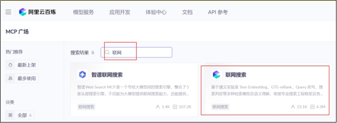

# 掌柜智库项目(RAG)实战

## 9. 检索数据节点实现与测试

### 9.4 网络搜索文档 (node_web_search_mcp)

**文件**: `app/query_process/agent/nodes/node_web_search_mcp.py`

#### 9.4.1 mcp的调用的准备工作

MCP 服务需先在阿里云百炼平台完成开通与配置，才能通过代码调用，以下是完整的开通流程说明：

**步骤1：前提条件**

已注册阿里云账号，并完成实名认证（百炼 MCP 服务需实名认证后使用）。

**步骤2：开通百炼 MCP 服务的详细步骤**

1、进入百炼 MCP 广场

打开浏览器，访问百炼 MCP 服务市场链接：

[https://bailian.console.aliyun.com/cn-beijing/?spm=a2c4g.11186623.0.0.5f885389KrrOsZ&tab=mcp#/mcp-market](#/mcp-market)

（若链接失效，可通过阿里云官网→“产品”→“人工智能”→“百炼”→“MCP 广场” 进入）

2、搜索并选择目标 MCP 服务

​	在 MCP 广场的搜索框中输入关键词（如 “联网搜索”）；

​	在搜索结果中找到目标服务（如本场景的 “联网搜索”），点击服务卡片进入详情页。



**步骤 3：开通 MCP 服务**

进入服务详情页后，点击 “开通服务” 按钮，会弹出 “开通 MCP 服务” 配置窗口，需完成以下配置：


1. **选择 API Key**：从下拉框中选择已有的`DASHSCOPE_API_KEY`（若未创建，需先在百炼控制台的 “API 密钥管理” 中生成）；
2. 选择部署模式：
   - 推荐选择「个人 FC 资源部署」（资源独立、安全隔离，适合正式场景）；
   - 测试场景可选择「公共 FC 资源部署」（共享资源，启动更快）；
3. 选择计费模式（个人FC资源部署）：
   - 「基础模式」：按调用时长计费（0.000156 元 / 秒），调用后释放资源，成本低；
   - 「极速模式」：按部署时长计费（0.13 元 / 时），启动速度极快（冷启动≤5 毫秒），适合低延迟场景；
4. **选择部署地域**：建议选择与业务服务器同地域（如 “华东 2（上海）”），降低网络延迟；
5. 确认配置后，点击 “确认开通” 按钮，等待百炼平台完成服务部署（通常 1-2 分钟）。

**步骤 4：获取 MCP 服务地址**

开通完成后，在服务详情页的 “调用信息” 区域，复制对应的**MCP 服务 SSE 地址**（如本场景的`https://dashscope.aliyuncs.com/api/v1/mcps/WebSearch/sse`），后续代码中需将该地址配置到`.env`文件的`MCP_DASHSCOPE_BASE_URL`中。

#### 9.4.2 处理策略

**1) 获取查询词**

从 LangGraph 全局状态对象`state`中提取**重写后的精准查询语句**（`rewritten_query`），为标准化搜索关键词；若该字段为空 / 未提取到，直接终止后续流程，避免无效 MCP 调用。

**2) 初始化 MCP 连接**

基于`MCPServerSse`创建 MCP 客户端实例，配置百炼 MCP 核心连接参数后，通过`await search_mcp.connect()`建立 SSE 流式连接（连接成功返回`{"type": "connect", "success": true}`）。

核心配置参数（JSON 格式）：

```json
{
  "url": "百炼MCP SSE接口地址（.env中MCP_DASHSCOPE_BASE_URL）",
  "headers": {
    "Authorization": "百炼/阿里云API密钥（.env中OPENAI_API_KEY）"
  },
  "timeout": 300,  // 客户端整体超时时间（秒）
  "sse_read_timeout": 300  // SSE流式读取超时时间（秒）
}
```

**3) 调用搜索工具**

基于已建立的 MCP 连接，通过`call_tool()`调用百炼专属搜索工具`bailian_web_search`，**工具调用固定传参格式（JSON）**，参数不可随意修改：

```
{
  "tool_name": "bailian_web_search",  // 固定值，百炼搜索工具唯一标识
  "arguments": {
    "query": "步骤1提取的rewritten_query",  // 必选，搜索查询词
    "count": 5  // 可选，返回结果数量，默认5条（建议1-10）
  }
}
```

**4) 解析与格式化**

接收 MCP 流式响应，提取有效数据并清洗，最终封装为统一格式文档列表，为后续节点提供标准化数据。

① MCP 原始返回值（核心有效片段，SSE 流式 JSON）

```json
{
  "type": "tool_call",
  "content": [
    {
      "text": "{\"pages\": [{\"title\": \"结果标题\", \"url\": \"结果链接\", \"snippet\": \"核心摘要\", \"source\": \"数据源\"}]}"
    }
  ]
}
```

② 解析规则

1. 过滤出`type: "tool_call"`的响应，提取`content[0].text`并转为 JSON 对象；
2. 提取对象中`pages`数组，遍历后仅保留`title`/`url`/`snippet`三个核心字段；
3. 对所有字段做清洗（去首尾空格、过滤空值），剔除`snippet`为空的无效结果。

③ 最终格式化结果（列表嵌套字典，统一格式）

```json
[
  {
    "title": "清洗后的结果标题",
    "url": "清洗后的结果链接",
    "snippet": "清洗后的核心摘要（非空）"
  }
]
```

**5) 更新状态与资源清理**

① 资源清理

无论调用成功 / 失败 / 中断，均通过`await search_mcp.cleanup()`关闭 MCP 连接，释放客户端资源，避免资源泄漏。

② 状态更新返回

将步骤 4 格式化后的文档列表，以`web_search_docs`为字段名更新到 LangGraph 全局状态并返回，供后续节点（重排序、大模型生成）使用；无有效结果则返回空字典。

最终返回状态（JSON）

```json
{
  "web_search_docs": [
    {
      "title": "HAK 180 烫金机官方操作手册",
      "url": "https://xxx.com/hak180/manual",
      "snippet": "HAK 180 顶部50-170mm局部烫金设置：操作面板【转印参数】-【区域设置】，选择顶部局部，输入起始50mm、结束170mm，保存生效"
    }
  ]
}
```

#### 9.4.3 处理关键点

百炼 MCP 官方 SDK 的核心方法（`connect()`、`call_tool()`、`cleanup()`等）均为**异步函数（async def）**，而本项目中使用的 LangGraph 框架，其节点函数默认采用**同步调用方式（invoke）**。

由于 Python 语法限制，**同步函数中无法直接调用异步方法**（会抛出`SyntaxError`异常），因此需要让 LangGraph 的搜索节点（`node_web_search_mcp`）以同步方式运行 MCP 的异步 API，核心解决方案是使用`asyncio.run()`做**同步 - 异步桥接**：通过该方法临时启动一个异步事件循环，执行 MCP 的所有异步代码，执行完成后自动关闭循环，回到同步逻辑，这是 Python 中同步代码调用异步代码的标准方案。 

#### 9.4.4 代码实现

##### 步骤1： 准备和环境

需安装百炼 MCP 官方 SDK 和 Python 异步相关依赖，执行以下命令：

```cmd
# 核心依赖：百炼MCP SDK（openai-agents）
uv add openai-agents
# 其他基础依赖（若未安装）：langgraph、requests、python-dotenv
uv add langgraph requests python-dotenv
```

配置文件和加载

环境变量配置（.env 文件）

在项目根目录创建`.env`文件，添加以下配置（替换为自身的百炼 API 密钥）：

```ini
# 百炼MCP WebSearch的SSE接口地址（固定值，无需修改）
MCP_DASHSCOPE_BASE_URL=https://dashscope.aliyuncs.com/api/v1/mcps/WebSearch/sse
# 你的阿里云/百炼平台API密钥（从百炼控制台获取，必填）
OPENAI_API_KEY=your_aliyun_bailian_api_key
```

定义读取配置文件

位置：`app/config/bailian_mcp_config.py`

```python
# 导入核心依赖：数据类、环境变量读取、路径处理
from dataclasses import dataclass
import os
from dotenv import load_dotenv

load_dotenv()


# 定义mcp的服务配置
@dataclass
class McpConfig:
    mcp_base_url: str
    api_key : str

mcp_config = McpConfig(
    mcp_base_url=os.getenv("MCP_DASHSCOPE_BASE_URL"),
    api_key=os.getenv("OPENAI_API_KEY")
)
```

##### 步骤2：导入基础依赖

```python
import sys
import json
import asyncio
from app.utils.task_utils import add_done_task, add_running_task
from app.conf.bailian_mcp_config import mcp_config
from agents.mcp import MCPServerSse
from app.core.logger import logger
```

##### 步骤3：定义mcp网络访问工具

```python
async def mcp_call(query):
    """
    异步调用百炼MCP搜索服务的核心函数。
    
    该函数负责初始化MCP客户端，建立SSE连接，调用远程工具，并返回原始结果。
    
    :param query: 搜索查询词（通常是经过改写后的精准Query）
    :return: MCP返回的原始结果对象 (包含 content, isError 等字段)
    """
    
    # ==================================================================================
    # 初始化百炼MCP SSE客户端
    # ----------------------------------------------------------------------------------
    # MCPServerSse 是一个基于 SSE (Server-Sent Events) 协议的 MCP 客户端实现。
    # 它的作用是连接到阿里云百炼提供的 MCP 服务端点，从而让我们可以像调用本地函数一样调用远程工具。
    #
    # 参数解释：
    # name: 客户端名称，用于日志标识，方便调试。
    # params: 连接配置字典
    #   - url: MCP 服务的 SSE 接口地址 (例如: .../mcps/WebSearch/sse)
    #   - headers: HTTP 请求头，必须包含 Authorization 字段传入 API Key 进行鉴权。
    #   - timeout: 连接建立和整体请求的超时时间。
    #   - sse_read_timeout: 读取 SSE 事件流的超时时间，防止流中断导致挂起。
    # ==================================================================================
    search_mcp = MCPServerSse(
        name="search_mcp",
        params={
            "url": mcp_config.mcp_base_url,
            "headers": {"Authorization": mcp_config.api_key},
            "timeout": 300,
            "sse_read_timeout": 300
        }
    )

    try:
        logger.info(f"[MCP] 正在连接百炼 WebSearch 服务: {mcp_config.mcp_base_url}")
        # 建立与MCP服务的SSE连接（异步方法，需await）
        await search_mcp.connect()
        
        logger.info(f"[MCP] 连接成功，正在调用工具 'bailian_web_search' 查询: {query}")
        # 调用百炼MCP的搜索工具（核心步骤）
        # tool_name: "bailian_web_search" 是百炼官方定义的工具名称
        # arguments: 工具所需的参数，这里需要 "query" (查询词) 和 "count" (返回数量)
        result = await search_mcp.call_tool(
            tool_name="bailian_web_search", 
            arguments={"query": query, "count": 5}
        )
        logger.info("[MCP] 工具调用完成，已获取返回结果")
        return result
        
    except Exception as e:
        logger.error(f"[MCP] 调用过程中发生异常: {e}", exc_info=True)
        return None
        
    finally:
        # 无论调用成功/失败，最终都关闭MCP连接（释放资源，异步方法）
        await search_mcp.cleanup()
```

##### 步骤4：主流程编写

```python
def node_web_search_mcp(state):
    """
    LangGraph同步节点函数：处理MCP搜索逻辑，作为整个搜索流程的入口。
    
    该节点会调用 mcp_call 异步函数获取搜索结果，并将其解析为结构化数据存储到 state 中。
    
    :param state: LangGraph的全局状态对象，包含 session_id, rewritten_query 等信息
    :return: 字典，包含结构化的搜索结果 web_search_docs，供后续节点使用
    """
    logger.info("---node_web_search_mcp 开始处理---")
    
    # 1. 标记任务开始
    add_running_task(state["session_id"], sys._getframe().f_code.co_name, state.get("is_stream"))

    # 2. 获取查询词
    query = state.get("rewritten_query", "")
    if not query:
        # 尝试回退到原始查询
        query = state.get("original_query", "")
        
    docs = []
    
    # 3. 执行搜索
    if query:
        try:
            # 同步-异步桥接：通过asyncio.run()执行异步的mcp_call函数
            logger.info(f"启动异步 MCP 调用，Query: {query}")
            
            # ======================================================================
            # MCP 返回结果格式解析说明
            # ----------------------------------------------------------------------
            # result 是一个 CallToolResult 对象 (定义在 agents.mcp.types 中)
            # result.content 是一个 TextContent 对象的列表，通常只有一项
            # result.content[0].text 是一个 JSON 字符串，包含实际的搜索结果
            #
            # 示例数据结构：
            # result.content[0].text = """
            # {
            #   "pages": [
            #     {
            #       "title": "HAK 180 烫金机使用手册",
            #       "url": "http://example.com/manual",
            #       "snippet": "在出厂默认状态下，若想设置局部转印..."
            #     },
            #     ...
            #   ]
            # }
            # """
            # ======================================================================
            result = asyncio.run(mcp_call(query))
            
            # 4. 解析结果
            if result and not result.isError and result.content:
                # 解析MCP原始结果：提取文本内容并转为JSON对象
                # result.content 通常是一个列表，第一项包含文本结果
                raw_text = result.content[0].text
                try:
                    data = json.loads(raw_text)
                    pages = data.get("pages") or []
                    
                    logger.info(f"MCP 返回原始页面数量: {len(pages)}")
                    
                    # 遍历结果，统一封装为结构化格式
                    for item in pages:
                        snippet = (item.get("snippet") or "").strip()
                        url = (item.get("url") or "").strip()
                        title = (item.get("title") or "").strip()
                        
                        # 过滤无核心摘要的结果
                        if not snippet:
                            continue
                            
                        docs.append({"title": title, "url": url, "snippet": snippet})
                        
                except json.JSONDecodeError:
                    logger.error(f"MCP 返回结果解析 JSON 失败: {raw_text[:100]}...")
            else:
                if result and result.isError:
                    logger.error(f"MCP 返回错误: {result}")
                else:
                    logger.warning("MCP 返回结果为空或无效")

            logger.info(f"结构化搜索结果数量: {len(docs)}")
            
        except Exception as e:
            logger.error(f"MCP 搜索节点执行异常: {e}", exc_info=True)
    else:
        logger.warning("查询词为空，跳过 MCP 搜索")

    # 5. 标记任务结束
    add_done_task(state["session_id"], sys._getframe().f_code.co_name, state.get("is_stream"))
    
    logger.info("---node_web_search_mcp 处理结束---")
    
    # 若有有效搜索结果，返回结果供后续节点使用；无则返回空字典
    if docs:
        return {"web_search_docs": docs}
    return {}
```

#### 9.4.5 主流程测试

```python
if __name__ == '__main__':
    # 测试代码：单独运行该文件时，验证MCP搜索功能是否正常
    print("\n" + "="*50)
    print(">>> 启动 node_web_search_mcp 本地测试")
    print("="*50)
    
    test_state = {
        "session_id": "test_mcp_session",
        "rewritten_query": "HAK 180 在出厂默认状态下，若想在纸张上只把烫金膜转印到顶部 50 mm–170 mm 的局部区域，应在操作面板上如何设置",
        "is_stream": False
    }

    try:
        # 调用MCP搜索节点函数，执行测试
        result_state = node_web_search_mcp(test_state)

        print("\n" + "="*50)
        print(">>> 测试结果摘要:")
        search_results = result_state.get('web_search_docs', [])
        print(f"搜索结果数量: {len(search_results)}")
        if search_results:
            print("首条结果预览:")
            print(json.dumps(search_results[0], indent=2, ensure_ascii=False))
        else:
            print("未获取到搜索结果")
        print("="*50)
        
    except Exception as e:
        logger.exception(f"测试运行期间发生未捕获异常: {e}")
```

